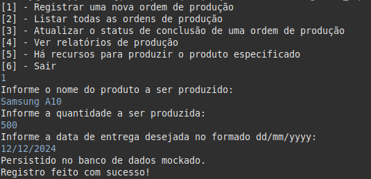
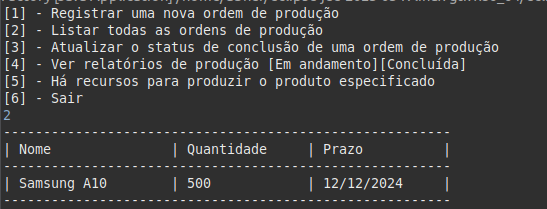
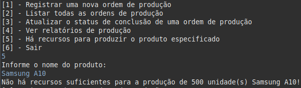
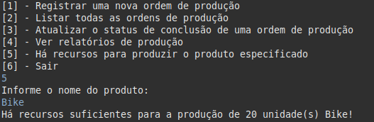
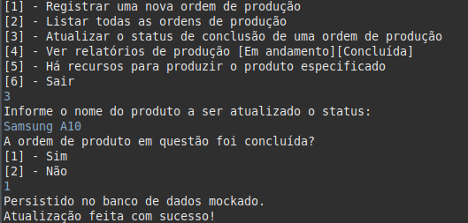
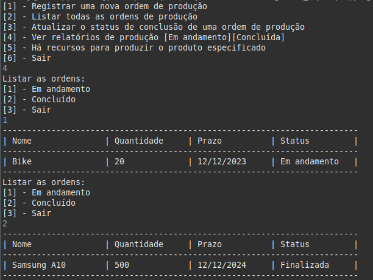

<h1 align="center">🚀 Bem vindo ao projeto CLI Factory! 🚀</h1>

O projeto foi feito em Java usando uma arquivo data.json como banco de dados.
Todos as instruções de como preencher os campos de entrada estão nos comentários do código e nos exemplos a seguir.

<h3>💥 Rodando o projeto e os recursos da API na sua máquina </h3>

<strong>Como rodar?</strong>

1. Clone o repositório com o comando:
  - `git clone git@github.com:abnerferreiradesousa/cli-factory.git`;
    - Entre na pasta do repositório:
      - `cd cli-factory`
2. Instale as dependências via terminal `mvn install`;
3. Rode o programa com o seguinte comando `mvn exec:java -Dexec.mainClass="com.factory.Factory"`;

<h3>💥 Requisitos</h3>

<strong>1. Registrar uma nova ordem de produção, especificando o produto a ser fabricado, a quantidade desejada e a data de entrega.</strong>

  

<strong>2. Listar todas as ordens de produção existentes, mostrando os detalhes de cada ordem, como o produto, a quantidade e a data de entrega.</strong>

  

<strong>3. Verificar se o produto pode ser produzido com base nos materiais disponíveis. Caso contrário, o sistema deve avisar que a produção não é possível devido à falta de materiais.</strong>

  
Sem recursos suficientes:
  
  
  
Com recursos suficientes:

  

<strong>4. Atualizar o status de uma ordem de produção, indicando se foi concluída ou não.</strong>

  

<strong>5. Visualizar relatórios de produção que mostrem as ordens em andamento e as concluídas.</strong>

  

